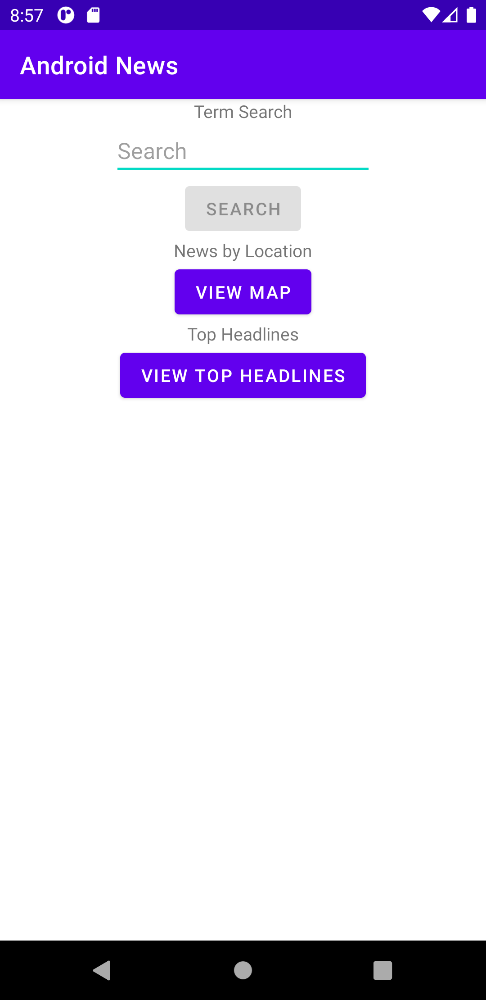
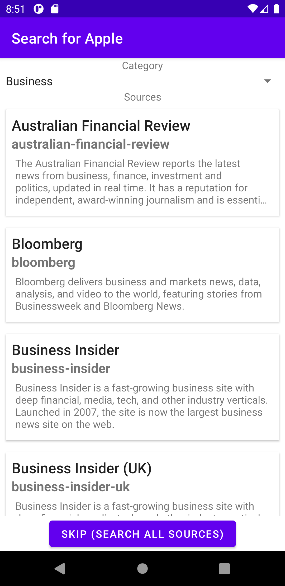
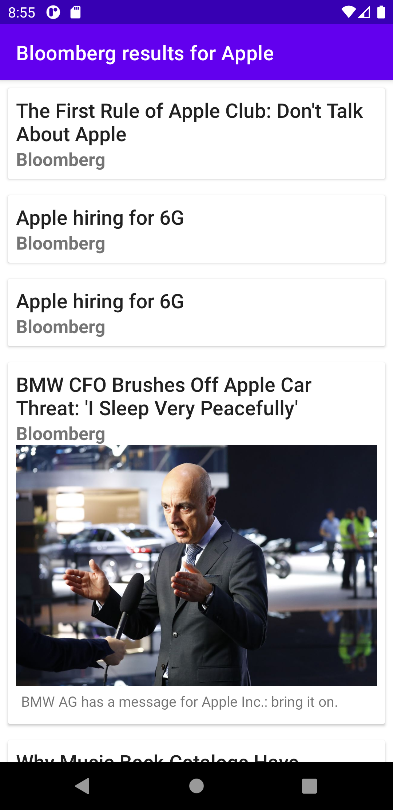
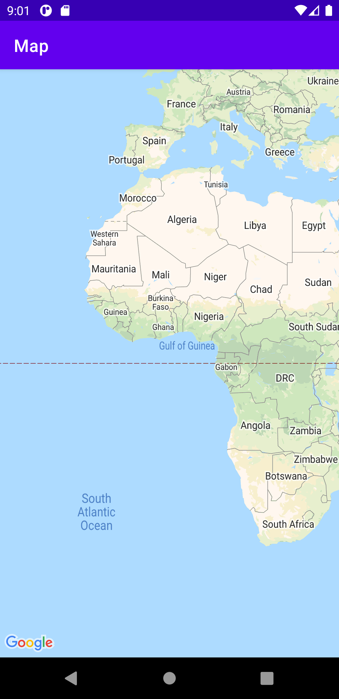
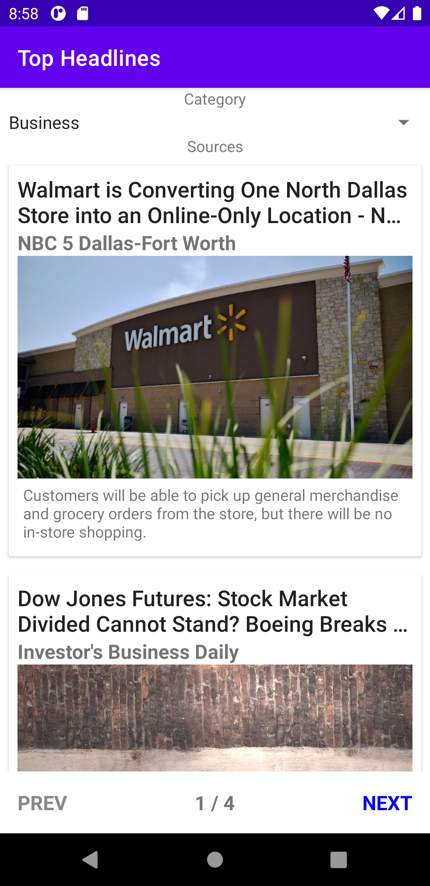
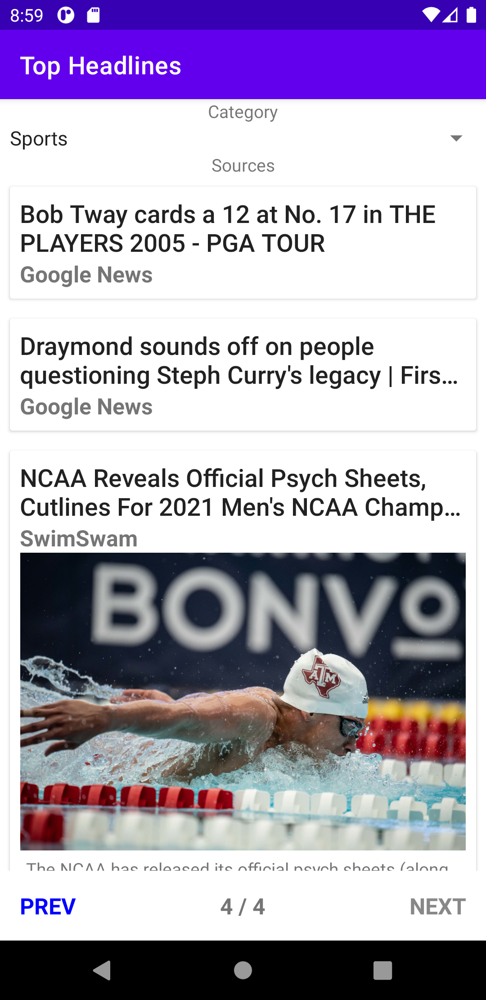

Android News
Android News is a simple app to aggregate news from multiple sources. It can be used to view top headlines for broad categories, perform specific term searches, view news from specific sources, and view local news in different areas of the world!

----

  

Home screen allows user to search by a specific term, geographic location, or view top news headlines</>

----

  
  
  

Once inputing search a search term, the user is prompted with categories to filter by and their associated sources (left). Selecting a source filters all news stories by the chosen source (middle). The user may also choose to search all sources (right)</>
  
----
  

  
  

Search by location launches a world map where a user can tap anywhere on the world to get news from a specified region. User can then swipe left to scroll through all fetched articles for their selected region. The news articles fetched is also based on the device's default language setting. E.g. Clicking on Barcelona, Spain will yield English articles for English users and Spanish articles for Spanish users</>
  
----

  
  
  

The user can also view the top headlines for various categories</>
  
----
  
## TODO
1. xml template used for sourceActivity's recyclerView and MapActivity's recyclerView should be different
2. Figure out a way to handle different size results so they are displatyed more neatly. Right now they vary much in size
3. Clean up code - redundant code in some place
4. Remove api key from commit history
5. Could use cardView instead of buttons
